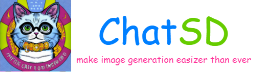
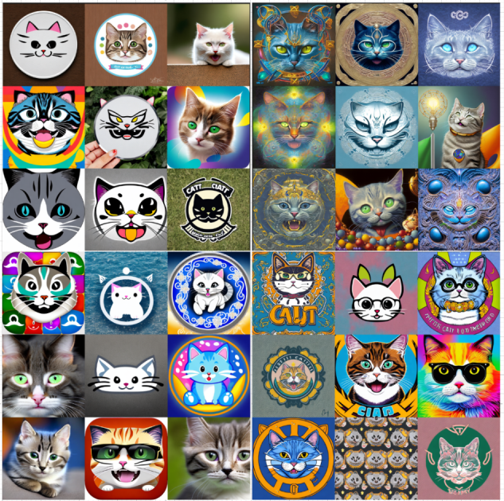

<p align="center" width="100%">

</p>

----------------

ChatSD is designed to make image generation tasks easily.

ChatSD is based on LLM(Large Language Model) and Stable Diffusion model. So when you communicate with ChatSD, it can understand your intentions and interpret them to appropriate prompts, and pass them into Stable Diffusion model for image generation.

At this point, ChatSD uses [ChatGLM-6B](https://huggingface.co/THUDM/chatglm-6b) and [Openjourney](https://huggingface.co/prompthero/openjourney), it may support more LLMs and Diffusion models in the future. (**Note**: this is a project for me to understand llm/diffusion/langchain better)

## Quick Start

1. Clone the project and go to the project workspace:

```bash
# clone the project
git clone ....

# go to directory
cd ChatSD
```

2. Create a conda environment named `chatsd` and activate it:

```bash
# create a environment named `chatsd` and activate it
conda env create -f environment.yaml
conda activate chatsd
```

**Note:** if you want to remove the environment, then execute:

```bash
conda deactivate
conda remove -n chatsd --all
```

3. Install the cuda version of `torch`:

refer to [https://pytorch.org/](https://pytorch.org/) and execute:

```bash
## cuda version 11.8
pip install torch torchvision torchaudio --index-url https://download.pytorch.org/whl/cu118
```


3. Run the `main.py` script:

```bash
python main.py
```

**Note:** run the script will download pretrained models from [Hugging Face](https://huggingface.co/), and if the download process is interrupted due to the unstable network, you can re-execute the script for multiple times for downloading the models continuously.

If you want to input your instructions to ChatSD, then execute:

```bash
python main.py --input "Generate an image of cat for me" --grid_rows 2 --grid_cols 2 --image_output_dir "images"
```


## Examples

I want to generate a logo for this project, so I execute the following command for 4 times:

```bash
python main.py --input "logo of cat, cute, happy, smile" --grid_rows=3 --grid_cols=3
```

and the results are:

<p align="center"></p>


## Acknowledgement

I appreciate the open source of the following projects. Thanks to all the developers, your efforts make the world a better place:

[visual-chatgpt](https://github.com/microsoft/visual-chatgpt) &#8194;
[Hugging Face](https://github.com/huggingface) &#8194;
[LangChain](https://github.com/hwchase17/langchain) &#8194;
[Stable Diffusion](https://github.com/CompVis/stable-diffusion) &#8194; 
[ChatGLM-6B](https://github.com/THUDM/ChatGLM-6B) &#8194;
[clip-interrogator](https://github.com/pharmapsychotic/clip-interrogator) &#8194; 
[text2image-prompt-generator](https://huggingface.co/succinctly/text2image-prompt-generator) &#8194; 
[prompt-generator](https://huggingface.co/spaces/doevent/prompt-generator) &#8194; 
[openjourney](https://huggingface.co/prompthero/openjourney) &#8194; 